# Content Guard

A full-stack AI-powered application for real-time multi-modal content moderation.

The system provides a centralized platform to analyze text and images using Natural Language Processing and Computer Vision models, generate moderation decisions, monitor system health, and maintain moderation history through a microservices-based backend.

## Features

- Real-time text toxicity detection
- Multi-modal image content moderation
- General object detection using YOLOv8
- Custom-trained weapons detection
- NSFW image classification
- Centralized moderation decision engine
- Configurable moderation thresholds
- Moderation history and statistics
- System health monitoring
- AI model insights dashboard
- Responsive React frontend
- FastAPI microservices architecture
- SQLite-based moderation logging
- RESTful communication between frontend and backend services

## Technology Stack

### Frontend

- React
- Vite
- JavaScript
- HTML
- CSS

### Backend

- Python
- FastAPI
- HTTPX
- REST APIs

### AI / Machine Learning

- Hugging Face Transformers
- Toxic-BERT
- YOLOv8
- Custom-trained YOLOv8 Weapons Detector
- NSFW Image Classification

### Database

- SQLite

### Tools

- Git
- GitHub
- Google Colab
- Roboflow

## Project Structure

```text
content-guard/
│
├── backend/
│   ├── api_gateway/
│   │   ├── config.py
│   │   └── main.py
│   │
│   ├── image_moderation_service/
│   │   └── main.py
│   │
│   ├── logging_service/
│   │   ├── database.py
│   │   └── main.py
│   │
│   ├── moderation_decision_service/
│   │   ├── config.py
│   │   ├── decision_engine.py
│   │   └── main.py
│   │
│   └── text_moderation_service/
│       └── main.py
│
├── frontend/
│   ├── public/
│   │   └── images/
│   │
│   ├── src/
│   │   ├── assets/
│   │   ├── components/
│   │   ├── pages/
│   │   ├── App.css
│   │   ├── App.jsx
│   │   ├── index.css
│   │   └── main.jsx
│   │
│   ├── package.json
│   └── vite.config.js
│
├── ml/
│   └── weapons_detection/
│       └── training/
│           └── weapons_detector_training.ipynb
│
├── screenshots/
│   ├── about_1.png
│   ├── about_2.png
│   ├── architecture.png
│   ├── dashboard.png
│   ├── dashboard2.png
│   ├── history.png
│   ├── home.png
│   ├── image_moderation.png
│   ├── image_moderaton2.png
│   ├── model_insights.png
│   ├── system_health.png
│   ├── text_moderation.png
│   └── text_moderation2.png
│
├── data.yaml
├── main.py
├── test_image_model.py
├── test_text_model.py
└── .gitignore
```

## Application Architecture

Content Guard follows a microservices-based architecture where the React frontend communicates with an API Gateway, which coordinates independent text moderation, image moderation, decision, and logging services.

## Backend Setup

### 1. Clone the Repository

```bash
git clone https://github.com/Priyanka7093/content-guard.git
cd content-guard
```

### 2. Create a Python Virtual Environment

```bash
python -m venv venv
```

Activate the virtual environment on Windows:

```bash
venv\Scripts\Activate.ps1
```

### 3. Install Backend Dependencies

```bash
pip install fastapi uvicorn httpx python-multipart
pip install ultralytics transformers torch torchvision
```

### 4. Run the Backend Services

Start each service from its respective directory.

#### API Gateway

```bash
cd backend/api_gateway
uvicorn main:app --reload --port 8000
```

#### Text Moderation Service

```bash
cd backend/text_moderation_service
uvicorn main:app --reload --port 8001
```

#### Image Moderation Service

```bash
cd backend/image_moderation_service
uvicorn main:app --reload --port 8002
```

#### Moderation Decision Service

```bash
cd backend/moderation_decision_service
uvicorn main:app --reload --port 8003
```

#### Logging Service

```bash
cd backend/logging_service
uvicorn main:app --reload --port 8004
```

## Frontend Setup

Navigate to the frontend directory:

```bash
cd frontend
```

Install dependencies:

```bash
npm install
```

Start the React development server:

```bash
npm run dev
```

Open the local URL displayed by Vite in the terminal.

## Custom Model Training

Content Guard includes a custom-trained YOLOv8 weapons detection model.

The model was trained using a labeled dataset containing the following classes:

- Handgun
- Knife
- Missile
- Rifle
- Shotgun
- Sword
- Tank

The training workflow was developed using Google Colab with GPU acceleration.

The complete training notebook is included in the repository:

```text
ml/weapons_detection/training/weapons_detector_training.ipynb
```

The dataset configuration used for the training workflow is also included in the project.

## Project Status

**Fully working end-to-end**

Content Guard integrates the React frontend, FastAPI microservices, AI moderation pipeline, moderation decision engine, logging system, dashboards, system health monitoring, and moderation history into a unified application.

## Technologies

`React` `Vite` `JavaScript` `Python` `FastAPI` `HTTPX` `Toxic-BERT` `YOLOv8` `Transformers` `SQLite` `Google Colab` `Roboflow` `Git` `GitHub`

---

## Application Screenshots

### Home Page

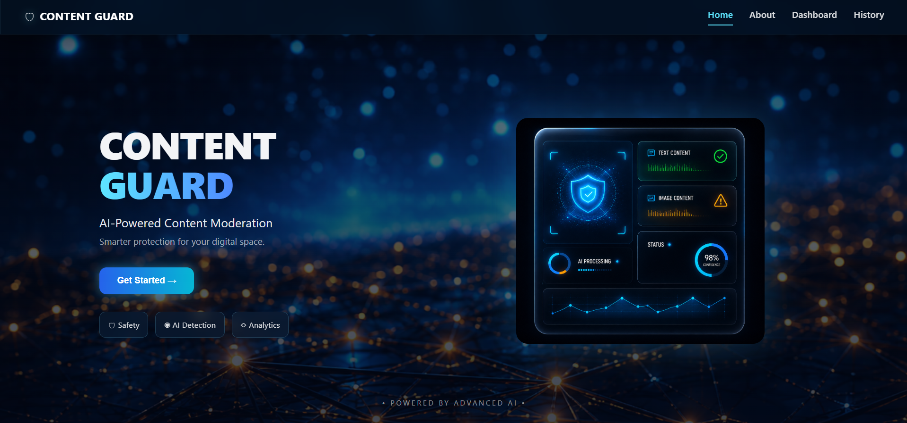

### Dashboard

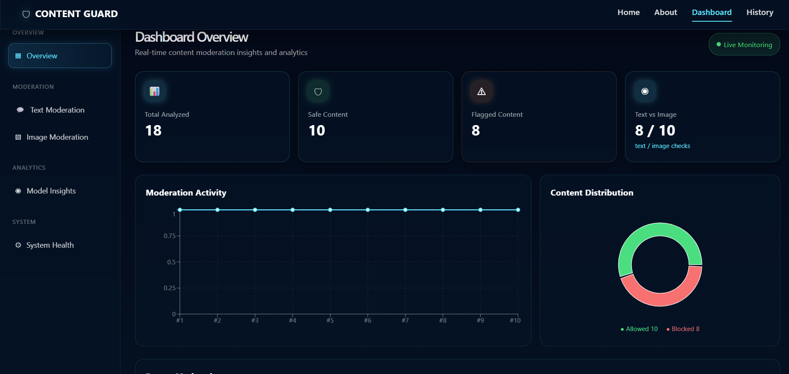

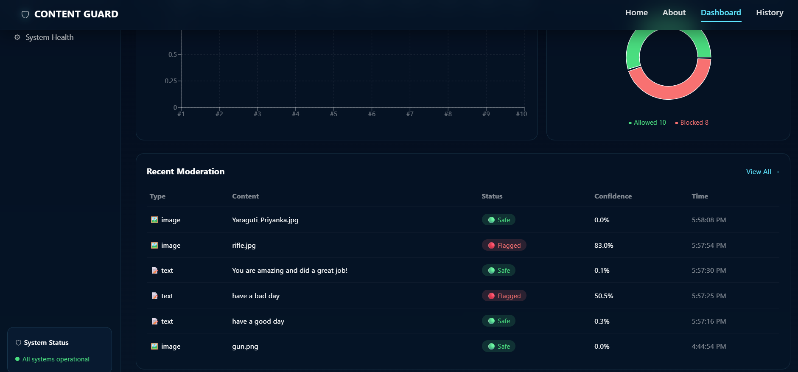

### Text Moderation

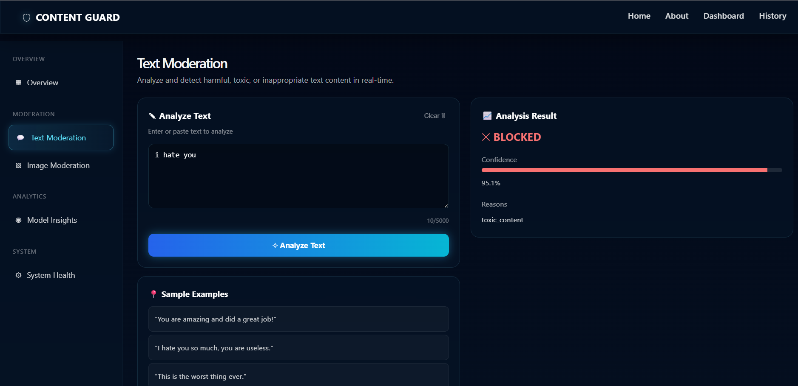

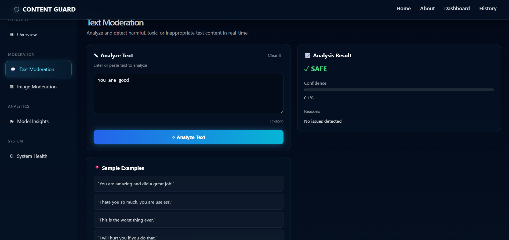

### Image Moderation

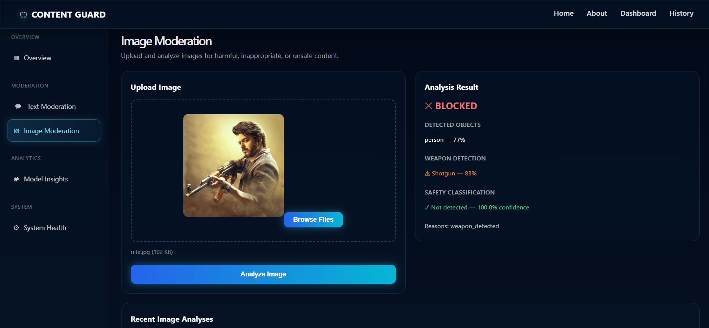

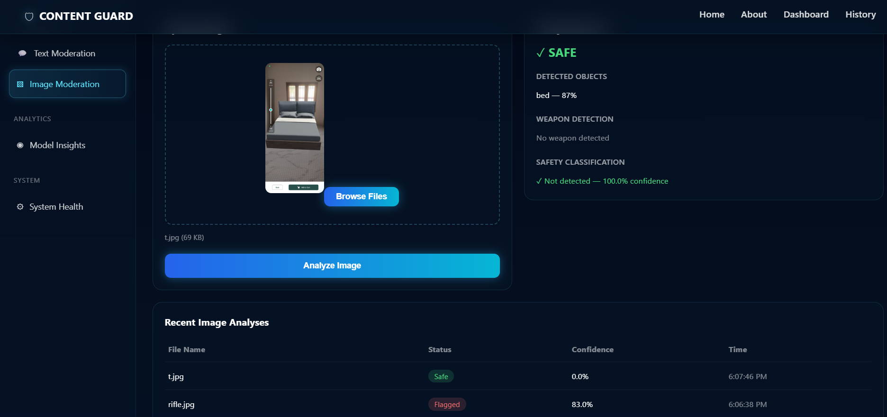

### Model Insights

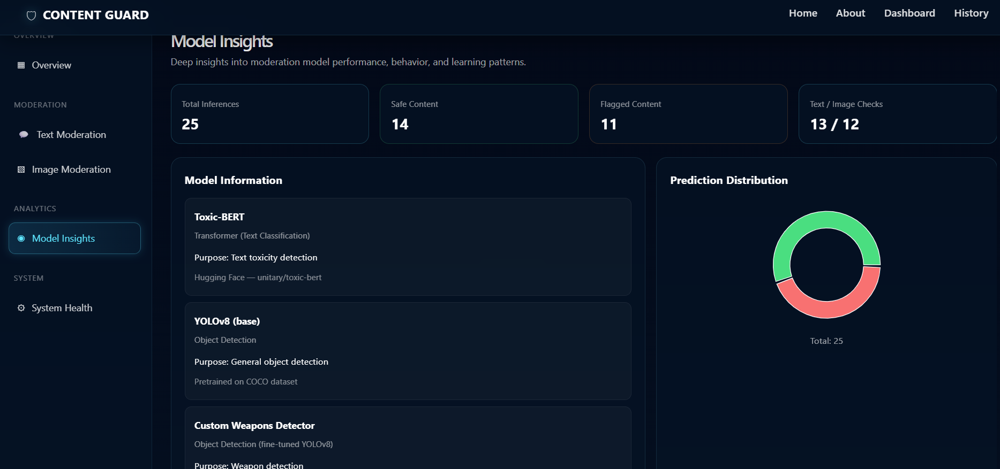

### System Health

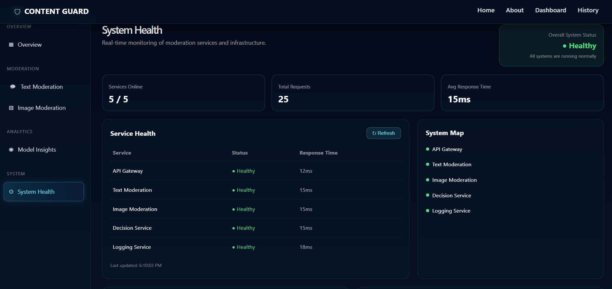

### Moderation History

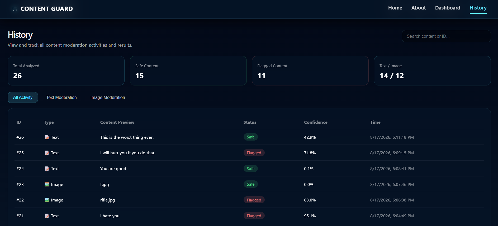

### About

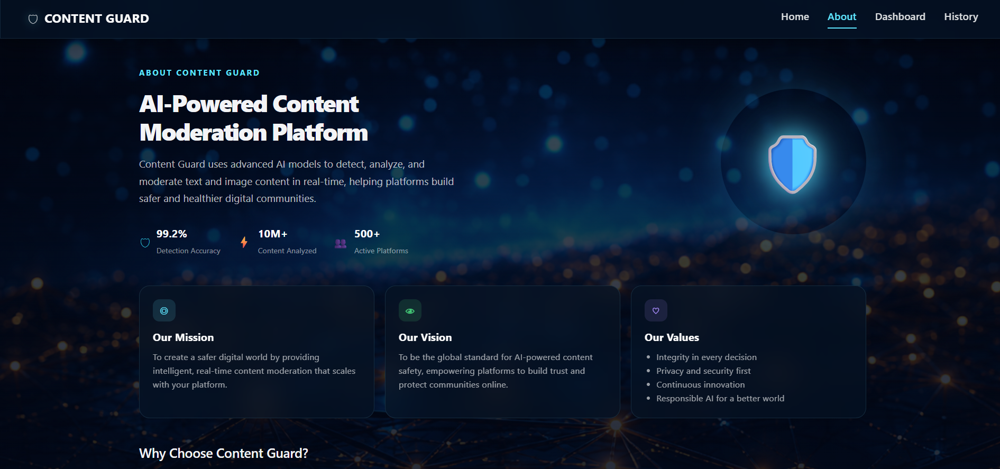


---

If you find this project useful, consider giving it a star.
